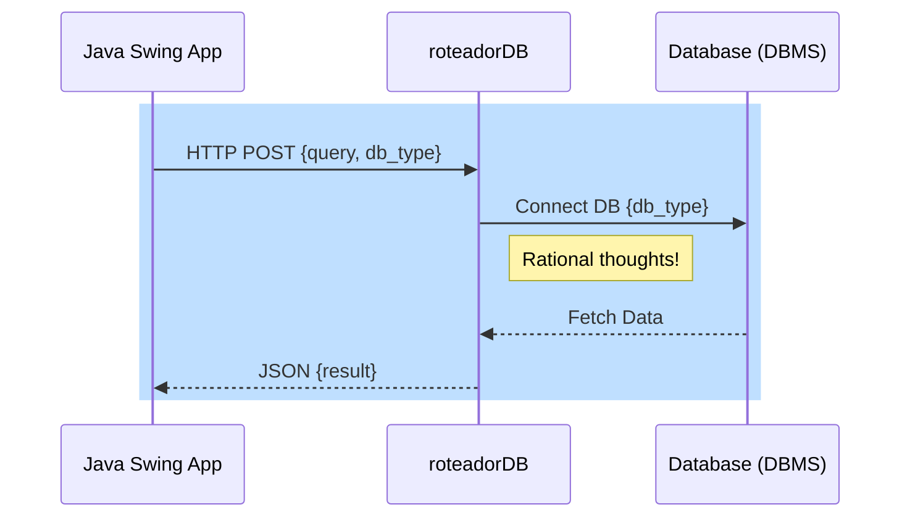

## 👋🏻 Evaldo de Souza Lima

Desenvolvedor em constante evolução, apaixonado pelo aprendizado.

## Conecte-se comigo
<table>
  <tbody align="left">
    <tr>
      <td>&nbsp;&nbsp;&nbsp;&nbsp;
      </td>
      <td>&nbsp;&nbsp;&nbsp;&nbsp;
      </td>
      <td>&nbsp;&nbsp;&nbsp;&nbsp;&nbsp;&nbsp;
      </td>
      <td>&nbsp;&nbsp;&nbsp;&nbsp;&nbsp;&nbsp;&nbsp;&nbsp;&nbsp;
      </td>
    </tr>
    <tr>
      <td>
      </td>
      <td>
      </td>
      <td>
      </td>
      <td>
      </td>
    </tr>
  </tbody>
</table>

## Linguagens de Marcação e Estilo
<table>
  <tbody align="left">
    <tr>
      <td>&nbsp;&nbsp;&nbsp;&nbsp;&nbsp;&nbsp;&nbsp;&nbsp;&nbsp;</td>
      <td>&nbsp;&nbsp;</td>
      <td>&nbsp;&nbsp;&nbsp;&nbsp;&nbsp;&nbsp;&nbsp;&nbsp;&nbsp;&nbsp;&nbsp;&nbsp;&nbsp;&nbsp;</td>
      <td>&nbsp;&nbsp;&nbsp;&nbsp;&nbsp;&nbsp;&nbsp;&nbsp;&nbsp;&nbsp;&nbsp;&nbsp;&nbsp;&nbsp;&nbsp;&nbsp;&nbsp;&nbsp;&nbsp;&nbsp;&nbsp;&nbsp;&nbsp;&nbsp;&nbsp;&nbsp;&nbsp;&nbsp;&nbsp;&nbsp;&nbsp;</td>
    </tr>  
    </tbody>
</table>

## Linguagens de Programação
<table>
  <tbody align="left">
    <tr>
      <td>&nbsp;&nbsp;&nbsp;&nbsp;&nbsp;&nbsp;&nbsp;&nbsp;&nbsp;&nbsp;&nbsp;&nbsp;&nbsp;&nbsp;</td>
      <td></td>
      <td>&nbsp;&nbsp;&nbsp;</td>
      <td>&nbsp;&nbsp;&nbsp;&nbsp;&nbsp;&nbsp;&nbsp;&nbsp;&nbsp;&nbsp;&nbsp;&nbsp;&nbsp;&nbsp;</td>
    </tr>
    <tr>
      <td></td>
      <td></td>
      <td>&nbsp;&nbsp;&nbsp;&nbsp;&nbsp;&nbsp;&nbsp;</td>
      <td></td>
    </tr>
    <tr>
      <td></td>
      <td></td>
      <td>&nbsp;&nbsp;&nbsp;&nbsp;&nbsp;&nbsp;&nbsp;</td>
      <td>&nbsp;&nbsp;&nbsp;&nbsp;&nbsp;&nbsp;&nbsp;&nbsp;&nbsp;&nbsp;</td>
    </tr>
    <tr>
      <td></td>
      <td></td>
      <td>&nbsp;&nbsp;&nbsp;&nbsp;&nbsp;&nbsp;&nbsp;</td>
      <td>&nbsp;&nbsp;&nbsp;&nbsp;&nbsp;&nbsp;&nbsp;&nbsp;&nbsp;&nbsp;&nbsp;&nbsp;&nbsp;&nbsp;&nbsp;&nbsp;&nbsp;&nbsp;&nbsp;</td>
    </tr>    
    </tbody>
</table>

## Bibliotecas e Frameworks
<table>
  <tbody align="left">
    <tr>
      <td>
        &nbsp;&nbsp;&nbsp;&nbsp;&nbsp;&nbsp;
      </td>
      <td>
        &nbsp;
      </td>
      <td>
        &nbsp;&nbsp;
      </td>
      <td>
        &nbsp;&nbsp;&nbsp;&nbsp;&nbsp;&nbsp;&nbsp;&nbsp;&nbsp;&nbsp;&nbsp;&nbsp;&nbsp;
      </td>      
    </tr>
   <tr>
      <td>
        
      </td>
      <td>
        
      </td>
      <td>
        
      </td>
      <td>
        
      </td>
   </tr>   
  </tbody>
</table>

## Banco de Dados
<table>
  <tbody align="left">
    <tr>
      <td>
        &nbsp;&nbsp;&nbsp;&nbsp;&nbsp;&nbsp;&nbsp;&nbsp;&nbsp;&nbsp;&nbsp;
      </td>
      <td>
        &nbsp;&nbsp;&nbsp;&nbsp;&nbsp;&nbsp;&nbsp;
      </td>
      <td>
        &nbsp;&nbsp;
      </td>
      <td>
        &nbsp;&nbsp;&nbsp;&nbsp;&nbsp;&nbsp;&nbsp;&nbsp;
      </td>      
    </tr>  
    <tr>
      <td>
        &nbsp;&nbsp;&nbsp;&nbsp;&nbsp;&nbsp;
      </td>
      <td>
      </td>
      <td>
      </td>
      <td>
      </td>      
    </tr>      
  </tbody>
</table>

## Cloud Computing Service
<table>
  <tbody align="left">
    <tr>
      <td>
         &nbsp;&nbsp;&nbsp;&nbsp;&nbsp;&nbsp;&nbsp;
      </td>
      <td>
         &nbsp;&nbsp;&nbsp;&nbsp;&nbsp;&nbsp;
      </td>
      <td>
        &nbsp;&nbsp;&nbsp;&nbsp;&nbsp;&nbsp;&nbsp;&nbsp;&nbsp;&nbsp;&nbsp;&nbsp;&nbsp;&nbsp;&nbsp;&nbsp;&nbsp;&nbsp;&nbsp;&nbsp;&nbsp;&nbsp;&nbsp;&nbsp;&nbsp;&nbsp;&nbsp;&nbsp;&nbsp;&nbsp;&nbsp;
      </td>
      <td>
        &nbsp;&nbsp;&nbsp;&nbsp;&nbsp;&nbsp;&nbsp;&nbsp;&nbsp;&nbsp;&nbsp;&nbsp;&nbsp;&nbsp;&nbsp;&nbsp;&nbsp;&nbsp;&nbsp;&nbsp;&nbsp;&nbsp;&nbsp;&nbsp;&nbsp;&nbsp;&nbsp;&nbsp;&nbsp;&nbsp;&nbsp;&nbsp;
      </td>      
    </tr>       
  </tbody>
</table>

## Sistema Operacional

<table>
  <tbody align="left">
    <tr>
      <td>
        &nbsp;&nbsp;&nbsp;&nbsp;&nbsp;&nbsp;&nbsp;&nbsp;&nbsp;&nbsp;&nbsp;&nbsp;&nbsp;
      </td>
      <td>
        &nbsp;&nbsp;&nbsp;&nbsp;&nbsp;&nbsp;
      </td>
      <td>
        
      </td>
      <td>
        &nbsp;&nbsp;&nbsp;&nbsp;&nbsp;
      </td>      
    </tr>
    <tr>
      <td>
        
      </td>
      <td>
        
      </td>
      <td>
        
      </td>
      <td>
        
      </td>      
    </tr>
    <tr>
      <td>
        
      </td>
      <td>
         &nbsp;&nbsp;&nbsp;&nbsp;&nbsp;&nbsp;
      </td>
      <td>
        &nbsp;&nbsp;&nbsp;&nbsp;&nbsp;&nbsp;&nbsp;&nbsp;&nbsp;&nbsp;&nbsp;&nbsp;&nbsp;&nbsp;&nbsp;&nbsp;&nbsp;&nbsp;&nbsp;&nbsp;&nbsp;&nbsp;&nbsp;&nbsp;&nbsp;&nbsp;&nbsp;&nbsp;&nbsp;&nbsp;&nbsp;
      </td>
      <td>
        &nbsp;&nbsp;&nbsp;&nbsp;&nbsp;&nbsp;&nbsp;&nbsp;&nbsp;&nbsp;&nbsp;&nbsp;&nbsp;&nbsp;&nbsp;&nbsp;&nbsp;&nbsp;&nbsp;&nbsp;&nbsp;&nbsp;&nbsp;&nbsp;&nbsp;&nbsp;&nbsp;&nbsp;&nbsp;&nbsp;&nbsp;&nbsp;&nbsp;
      </td>      
    </tr>
  </tbody>
  <tfoot></tfoot>
</table>

## Ferramentas
<table>
  <tbody align="left">
    <tr>
      <td>
        &nbsp;&nbsp;&nbsp;&nbsp;&nbsp;&nbsp;&nbsp;&nbsp;&nbsp;&nbsp;&nbsp;&nbsp;&nbsp;&nbsp;&nbsp;&nbsp;&nbsp;
      </td>
      <td>
         &nbsp;&nbsp;&nbsp;&nbsp;&nbsp;&nbsp;&nbsp;&nbsp;&nbsp;&nbsp;
      </td>
      <td>
         &nbsp;&nbsp;&nbsp;&nbsp;&nbsp;&nbsp;&nbsp;
      </td>
      <td>
        &nbsp;&nbsp;&nbsp;&nbsp;&nbsp;&nbsp;&nbsp;&nbsp;&nbsp;&nbsp;
      </td>      
    </tr>
  </tbody>
  <tfoot></tfoot>
</table>

## Frameworks, Platforms and Libraries
<table>
  <tbody align="left">
    <tr>
      <td>
         &nbsp;&nbsp;&nbsp;&nbsp;&nbsp;&nbsp;&nbsp;&nbsp;&nbsp;&nbsp;
      </td>
      <td>
         &nbsp;&nbsp;&nbsp;&nbsp;&nbsp;
      </td>
      <td>
        &nbsp;&nbsp;&nbsp;&nbsp;&nbsp;&nbsp;&nbsp;&nbsp;&nbsp;&nbsp;&nbsp;&nbsp;&nbsp;&nbsp;&nbsp;&nbsp;&nbsp;&nbsp;&nbsp;&nbsp;&nbsp;&nbsp;&nbsp;&nbsp;&nbsp;&nbsp;&nbsp;&nbsp;&nbsp;&nbsp;
      </td>
      <td>
        &nbsp;&nbsp;&nbsp;&nbsp;&nbsp;&nbsp;&nbsp;&nbsp;&nbsp;&nbsp;&nbsp;&nbsp;&nbsp;&nbsp;&nbsp;&nbsp;&nbsp;&nbsp;&nbsp;&nbsp;&nbsp;&nbsp;&nbsp;&nbsp;&nbsp;&nbsp;&nbsp;&nbsp;&nbsp;&nbsp;&nbsp;&nbsp;&nbsp;&nbsp;&nbsp;
      </td>      
    </tr>       
  </tbody>
</table>

## 💼 Experiência Profissional

Minhas experiências mais recentes estão relacionadas ao atendimento ao cliente, análise de laboratório, operação de sistemas de caixas e uma pequena experiência em liderança de equipe. Essas experiências me ajudaram a aprimorar minhas habilidades técnicas e interpessoais.

#  👋❤️ [About me](https://github.com/7131HDMC)

🐍 Hari Dasa Fiuza, the last one of my crazy parents. 
♊ 2001 
💻 Computer Technician - [Federal Center for Technological Education of Minas Gerais](https://www.cefetmg.br). 
🏠 I’m currently living in Belo Horizonte - MG , Brazil 🇧🇷.  
🎯 I’m a Software Engineer , ML Engineer. 
🔭 I’m looking to improve myself and solve problems around me. 
👄 I speak Portuguese, English, Spanish and Japanese. 
💬 Trying to learn Japanese. `trying my best` 
👥 I am a startup enthusiast, love to talk about new projects and real problems.  
👽 People consider me a proactive, creative guy and a problem solver . 
🚪 Always open to new challenges and projects. 

## Projetos

[🏛️ Blog Museu Nacional - Angular ](https://github.com/7iagoCabral/blog-museum-angular) 
[✅ BuzzFeed - Angular ](https://github.com/7iagoCabral/angular_buzzfeed_quizz) 
[🐦 PokeStore - React, Sass, Redux](https://github.com/7iagoCabral/pokestore) 
[❌ Jogo da velha - javascript](https://github.com/7iagoCabral/tic-tac-toe-Jogo-da-velha-) 
[🚀 NASA - Foto Astronômica do Dia - React, Tailwindcss, Api rest ](https://github.com/7iagoCabral/nasa-apod-Imagem-Astronomica-do-Dia) 

  

  ### I've already had contact with these technologies (either books, courses, personal or professional projects):

  

  

## Percurso
<table>
  <thead>
    <tr align="left">
      <th>Nº</th>
      <th>Etapas</th>
      <th>Materiais de Apoio</th>
    </tr>
  </thead>
  <tbody align="left">
    <tr>
      <td>01</td>
      <td>Introdução ao Lab</td>
      <td align="center">
        
      </td>
    </tr>
    <tr>
      <td>02</td>
      <td>Formas de Contribuir num Projeto Open Source</td>
      <td align="center">
        
      </td>
    </tr>
    <tr>
      <td>03</td>
      <td>Desenvolvendo e Enviando uma Contribuição</td>
      <td align="center">
        
      </td>    
    </tr>
    <tr>
      <td>04</td>
      <td>Dicas e Materiais de Apoio</td>
      <td align="center">
        
      </td>    
    </tr>
  </tbody>
  <tfoot></tfoot>
</table>

---

## Soft Skills

- Curiosidade
- Perfil Análitico
- Ivestigativo
- Fácil Adaptabilidade
- Confiabilidade
- Aprendizado Contínuo
- Trabalho em equipe

## Hard Skills

- Graduação em Marketing 
- Mestrados em Gestão Estratégica

## 👾 Hobbys

## Descrição

- **Apps/Clients**: Quatro aplicações diferentes (Java Swing, PHP, Python, Delphi) se conectam ao `roteadorDB`.
- **roteadorDB**: Um software desenvolvido em Python que funciona como intermediário entre os apps e os bancos de dados.
- **Bancos de Dados**: `Oracle`, `PgSQL` e `MySQL` são acessados pelo `roteadorDB` que distribui as requisições vindas dos diferentes clientes.

Este diagrama representa como os diversos componentes do sistema interagem entre si, com o `roteadorDB` servindo como um ponto central que gerencia o tráfego de dados entre os clientes e os bancos de dados.

# roteadorDB
Roteador para banco de dados Oracle, PgSQL, MySql, etc.

