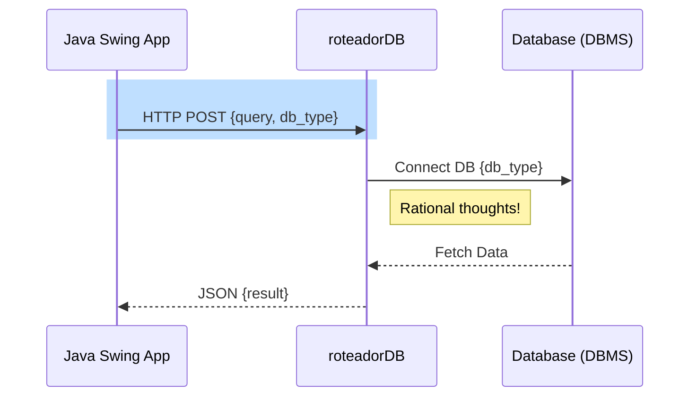

# roteadorDB
Roteador para banco de dados Oracle, PgSQL, MySql, etc.

mermaid.sequenceConfig = {
  diagramMarginX: 50,
  diagramMarginY: 10,
  boxTextMargin: 5,
  noteMargin: 10,
  messageMargin: 35,
  mirrorActors: true,
};

